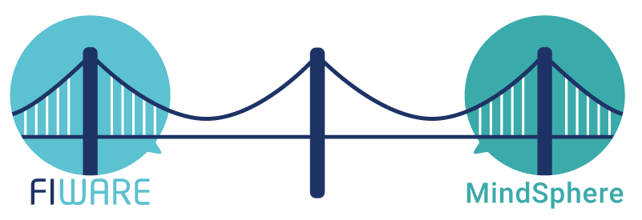

# FI-MIND (FIWARE-MINDSPHERE) Bridge
The FI-MIND bridge close the gap between MindSphere and FIWARE environments, easing the process of sharing assets and context data (legacy factory systems, non-production IoT data sources, etc.) between the two worlds.


## Contents

-   [Configuration](#configuration)
-   [Deploy](#deploy)
-   [API](#api)
-   [Supported Features](#supported-features)
-   [Testing](#testing)
-   [License](#license)

## Configuration
Configure MINDSPHERE settings in *config.properties* file:
```sh
ocb-url=http://{ocb-host}:{ocb-port}
client-id={mindpshere-client-id}
client-secret={mindpshere-client-secret}
tenant={mindpshere-tenant}
```
## Deploy
Generate WAR file executing into project root folder:
```sh
mvn clean install
```
Deploy WAR file (generated into target folder), as usual, in your web server.


## API

|     |     Service     |                          Description                          |
| --- | :-------------: | :-----------------------------------------------------------: |
| POST | `/ocb-export` | Export an existing MindSphere asset into Orion Context Broker |
| POST | `/fiware-notification` | Notification service to ingest data coming after subscription to Orion Context Broker |
| POST | `/alert` | Export an Alert entity into MindSphere |
| POST | `/alertNormalized` | Export a NGSI compliant Alert entity into MindSphere |
| POST | `/building` | Export a Building entity into MindSphere |
| POST | `/buildingNormalized` | Export a NGSI compliant Building entity into MindSphere |
| POST | `/buildingOperation` | Export a Building Operation entity into MindSphere |
| POST | `/buildingOperationNormalized` | Export a NGSI compliant Building Operation entity into MindSphere |
| POST | `/device` | Export a Device entity into MindSphere |
| POST | `/deviceNormalized` | Export a NGSI compliant Device entity into MindSphere |
| POST | `/deviceModel` | Export a Device Model entity into MindSphere |
| POST | `/deviceModelNormalized` | Export a NGSI compliant Device Model entity into MindSphere |
| POST | `/trafficFlowObserved` | Export a TrafficFlowObserved entity into MindSphere |
| POST | `/trafficFlowObservedNormalized` | Export a NGSI compliant TrafficFlowObserved entity into MindSphere |
| POST | `/vehicle` | Export a Vehicle entity into MindSphere |
| POST | `/vehicleNormalized` | Export a NGSI compliant Vehicle entity into MindSphere |
| POST | `/vehicleModel` | Export a Vehicle Model entity into MindSphere |
| POST | `/vehicleModelNormalized` | Export a NGSI compliant Vehicle Model entity into MindSphere |
| POST | `/weatherForecast` | Export a Weather Forecast entity into MindSphere |
| POST | `/weatherForecastNormalized` | Export a NGSI compliant WeatherForecast entity into MindSphere |
| POST | `/weatherObserved` | Export a Weather Observed entity into MindSphere |
| POST | `/weatherObservedNormalized` | Export a NGSI compliant Weather Observed entity into MindSphere |

## Supported Features
FI-MIND helps you setting up a two-way channel to share context data between FIWARE and MindSphere, back and forth. The two different channels are described below:

##### FIWARE to MindSphere
This channel let you export a subset of FIWARE Data Models into Mindsphere Environment *without loss of information*. In the table below is reported the documentation for each of the chosen FIWARE Data Models to be shared in MindSphere.

| __**FIWARE Data Model**__   | __**Status**__   | __**Comment**__   |__**FI-MIND Documentation**__   |
|-----------------------------|:--------------------------:|--------------------------|:--------------------------:|
|  [AeroAllergenObserved](https://fiware-datamodels.readthedocs.io/en/latest/Environment/AeroAllergenObserved/doc/spec/index.html)  |  :x:  |  Out of Domain  |  |
|  [AirQualityObserved](https://fiware-datamodels.readthedocs.io/en/latest/Environment/AirQualityObserved/doc/spec/index.html)  |  :x:  |  Out of Domain  |  |
|  [Alert](https://fiware-datamodels.readthedocs.io/en/latest/Alert/doc/spec/index.html)  |  :white_check_mark:  |  |  :books: [Documentation](docs/alert.md)  |
|  [ArrivalEstimation](https://fiware-datamodels.readthedocs.io/en/latest/UrbanMobility/ArrivalEstimation/doc/spec/index.html)  |  :x:  |  Out of Domain  |  |
|  [Beach](https://fiware-datamodels.readthedocs.io/en/latest/PointOfInterest/Beach/doc/spec/index.html)  |  :x:  |  Out of Domain  |  |
|  [BikeHireDockingStation](https://fiware-datamodels.readthedocs.io/en/latest/Transportation/Bike/BikeHireDockingStation/doc/spec/index.html)     |  :x:  |Out of Domain|  |
|  [Building](https://fiware-datamodels.readthedocs.io/en/latest/Building/Building/doc/spec/index.html)  |  :white_check_mark:  |  |  :books: [Documentation](docs/building.md)  |
|  [BuildingOperation](https://fiware-datamodels.readthedocs.io/en/latest/Building/BuildingOperation/doc/spec/index.html)  |  :white_check_mark:  |  |  :books: [Documentation](docs/buildingoperation.md)  |
|  [Device](https://fiware-datamodels.readthedocs.io/en/latest/Device/Device/doc/spec/index.html)  |  :white_check_mark:  |  |  :books: [Documentation](docs/device.md)   |
|  [DeviceModel](https://fiware-datamodels.readthedocs.io/en/latest/Device/DeviceModel/doc/spec/index.html)  |  :white_check_mark:  |  |  :books: [Documentation](docs/devicemodel.md)   |
|  [EVChargingStation](https://fiware-datamodels.readthedocs.io/en/latest/Transportation/EVChargingStation/doc/spec/index.html)  |  :x:  |  Out of Domain  |  |
|  [FlowerBed](https://fiware-datamodels.readthedocs.io/en/latest/ParksAndGardens/FlowerBed/doc/spec/index.html)  |  :x:  |  Out of Domain  |  |
|  [Garden](https://fiware-datamodels.readthedocs.io/en/latest/ParksAndGardens/Garden/doc/spec/index.html)  |  :x:  |  Out of Domain  |  |
|  [GreenSpaceRecord](https://fiware-datamodels.readthedocs.io/en/latest/ParksAndGardens/GreenspaceRecord/doc/spec/index.html)  |  :x:  |  Out of Domain  |  |
|  [GtfsAccessPoint](https://fiware-datamodels.readthedocs.io/en/latest/UrbanMobility/GtfsAccessPoint/doc/spec/index.html)|  :x:  |  Out of Domain  |  |
|  [GtfsAgency](https://fiware-datamodels.readthedocs.io/en/latest/UrbanMobility/GtfsAgency/doc/spec/index.html)  |  :x:  |  Out of Domain  |  |
|  [GtfsCalendarDataRule](https://fiware-datamodels.readthedocs.io/en/latest/UrbanMobility/GtfsCalendarDateRule/doc/spec/index.html)  |  :x:  |  Out of Domain  |  |
|  [GtfsCalendarRule](https://fiware-datamodels.readthedocs.io/en/latest/UrbanMobility/GtfsCalendarRule/doc/spec/index.html)  |  :x:  |  Out of Domain  |  |
|  [GtfsFrequency](https://fiware-datamodels.readthedocs.io/en/latest/UrbanMobility/GtfsFrequency/doc/spec/index.html)  |  :x:  |  Out of Domain  |  |
|  [GtfsRoute](https://fiware-datamodels.readthedocs.io/en/latest/UrbanMobility/GtfsRoute/doc/spec/index.html)  |  :x:  |  Out of Domain  |  |
|  [GtfsService](https://fiware-datamodels.readthedocs.io/en/latest/UrbanMobility/GtfsService/doc/spec/index.html)  |  :x:  |  Out of Domain  |  |
|  [GtfsShape](https://fiware-datamodels.readthedocs.io/en/latest/UrbanMobility/GtfsShape/doc/spec/index.html)  |  :x:  |  Out of Domain  |  |
|  [GtfsStation](https://fiware-datamodels.readthedocs.io/en/latest/UrbanMobility/GtfsStation/doc/spec/index.html)  |  :x:  |  Out of Domain  |  |
|  [GtfsStop](https://fiware-datamodels.readthedocs.io/en/latest/UrbanMobility/GtfsStop/doc/spec/index.html)  |  :x:  |  Out of Domain  |  |
|  [GtfsStopTime](https://fiware-datamodels.readthedocs.io/en/latest/UrbanMobility/GtfsStopTime/doc/spec/index.html)  |  :x:  |  Out of Domain  |  |
|  [GtfsTransferRule](https://fiware-datamodels.readthedocs.io/en/latest/UrbanMobility/GtfsTransferRule/doc/spec/index.html)  |  :x:  |  Out of Domain  |  |
|  [GtfsTrip](https://fiware-datamodels.readthedocs.io/en/latest/UrbanMobility/GtfsTrip/doc/spec/index.html)  | :x:  |  Out of Domain|  |
|  [KeyPerformanceIndicator](https://fiware-datamodels.readthedocs.io/en/latest/KeyPerformanceIndicator/doc/spec/index.html)  |  :x:  |  Out of Domain  |  |
|  [Museum](https://fiware-datamodels.readthedocs.io/en/latest/PointOfInterest/Museum/doc/spec/index.html)  |  :x:  |  Out of Domain  |  |
|  [NoiseLevelObserved](https://fiware-datamodels.readthedocs.io/en/latest/Environment/NoiseLevelObserved/doc/spec/index.html)  |  :x:  |  Out of Domain  |  |
|  [OffStreetParking](https://fiware-datamodels.readthedocs.io/en/latest/Parking/OffStreetParking/doc/spec/index.html)  |  :x:  |  Out of Domain  |  |
|  [OnStreetParking](https://fiware-datamodels.readthedocs.io/en/latest/Parking/OnStreetParking/doc/spec/index.html)  |  :x:  |  Out of Domain  |  |
|  [Open311:ServiceRequest](https://fiware-datamodels.readthedocs.io/en/latest/IssueTracking/Open311_ServiceRequest/doc/spec/index.html)  |  :x:  |  Out of Domain  |  |
|  [Open311:ServiceType](https://fiware-datamodels.readthedocs.io/en/latest/IssueTracking/Open311_ServiceType/doc/spec/index.html)  |  :x:  |  Out of Domain  |  |
|  [ParkingAccess](https://fiware-datamodels.readthedocs.io/en/latest/Parking/ParkingAccess/doc/spec/index.html)  |  :x:  |  Out of Domain  |  |
|  [ParkingGroup](https://fiware-datamodels.readthedocs.io/en/latest/Parking/ParkingGroup/doc/spec/index.html)  |  :x:  |  Out of Domain  |  |
|  [ParkingSpot](https://fiware-datamodels.readthedocs.io/en/latest/Parking/ParkingSpot/doc/spec/index.html)  |  :x:  |  Out of Domain  |  |
|  [PointOfInterest](https://fiware-datamodels.readthedocs.io/en/latest/PointOfInterest/PointOfInterest/doc/spec/index.html)  |  :x:  |  Out of Domain  |  |
|  [Road](https://fiware-datamodels.readthedocs.io/en/latest/Transportation/Road/doc/spec/index.html)  |  :x:  |  Out of Domain  |  |
|  [RoadSegment](https://fiware-datamodels.readthedocs.io/en/latest/Transportation/RoadSegment/doc/spec/index.html)  |  :x:  |  Out of Domain  |  |
|  [SmartPointOfInteraction](https://fiware-datamodels.readthedocs.io/en/latest/PointOfInteraction/SmartPointOfInteraction/doc/spec/index.html)  |  :x:  |  Out of Domain  |  |
|  [SmartSpot](https://fiware-datamodels.readthedocs.io/en/latest/PointOfInteraction/SmartSpot/doc/spec/index.html)  |  :x:  |  Out of Domain  |  |
|  [Streetlight](https://fiware-datamodels.readthedocs.io/en/latest/StreetLighting/Streetlight/doc/spec/index.html)  |  :x:  |  Out of Domain  |  |
|  [StreetlightModel](https://fiware-datamodels.readthedocs.io/en/latest/StreetLighting/StreetlightModel/doc/spec/index.html)  |  :x:  |  Out of Domain  |  |
|  [StreetlightGroup](https://fiware-datamodels.readthedocs.io/en/latest/StreetLighting/StreetlightGroup/doc/spec/index.html)  |  :x:  |  Out of Domain  |  |
|  [StreetlightControlCabinet](https://fiware-datamodels.readthedocs.io/en/latest/StreetLighting/StreetlightControlCabinet/doc/spec/index.html)  |  :x:  |  Out of Domain  |  |
|  [ThreePhaseAcMeasurement](https://fiware-datamodels.readthedocs.io/en/latest/Energy/ThreePhaseAcMeasurement/doc/spec/index.html)  |  :x:  |  Out of Domain  |  |
|  [TrafficFlowObserved](https://fiware-datamodels.readthedocs.io/en/latest/Transportation/TrafficFlowObserved/doc/spec/index.html)  |  :white_check_mark:  |  |  :books: [Documentation](docs/trafficflowobserved.md)  |
|  [Vehicle](https://fiware-datamodels.readthedocs.io/en/latest/Transportation/Vehicle/Vehicle/doc/spec/index.html)  |  :white_check_mark:  |  |  :books: [Documentation](docs/vehicle.md)  |
|  [VehicleModel](https://fiware-datamodels.readthedocs.io/en/latest/Transportation/Vehicle/VehicleModel/doc/spec/index.html)  |  :white_check_mark:  | | :books: [Documentation](docs/vehiclemodel.md)  |
|  [WasteContainer](https://fiware-datamodels.readthedocs.io/en/latest/WasteManagement/WasteContainer/doc/spec/index.html)  |  :x:  |  Out of Domain  |  |
|  [WasteContainerIsle](https://fiware-datamodels.readthedocs.io/en/latest/WasteManagement/WasteContainerIsle/doc/spec/index.html)  |  :x:  |  Out of Domain  |  |
|  [WasteContainerModel](https://fiware-datamodels.readthedocs.io/en/latest/WasteManagement/WasteContainerModel/doc/spec/index.html)  |  :x:  |  Out of Domain  |  |
|  [WaterQualityObserved](https://fiware-datamodels.readthedocs.io/en/latest/Environment/WaterQualityObserved/doc/spec/index.html)  |  :x:  |  Out of Domain  |  |
|  [WeatherForecast](https://fiware-datamodels.readthedocs.io/en/latest/Weather/WeatherForecast/doc/spec/index.html)  |  :white_check_mark:  |  |  :books: [Documentation](docs/weatherforecast.md)  |
|  [WeatherObserved](https://fiware-datamodels.readthedocs.io/en/latest/Weather/WeatherObserved/doc/spec/index.html)  |  :white_check_mark:  |  |  :books: [Documentation](docs/weatherobserved.md)  |

##### MindSphere to FIWARE

Given an existing asset in MindSphere, FIMIND let you export the resource to FIWARE, simply by passing its __asset_id__ as a query parameter of a HTTP GET request under the path of /ocb-export.

The export process will extract asset variables and aspect variables of the chosen asset mapping them in the proper format to be ingested by [Orion Context Broker](https://fiware-orion.readthedocs.io/en/master/).

Exporting is not restricted to FIWARE Data Models only, **every MindSphere asset** can be exported even though the mapping **won't be reversible without extending the current APIs.**

###### Example

```sh
curl -X POST \
  http://{server-url}:{server-port}/fimind/webapi/ocb-export \
  -H 'accept: application/json' \
  -H 'cache-control: no-cache' \
  -H 'content-type: application/json' \
  -d '{
    "assetId":"mindsphere_asset_id",
    "fiwareService":"connector",
    "fiwareServicePath":"/demo"
  }'

```

## Testing
You can test POST REST API by adding the header:

```
debug-mode : true
```
to the request.

##### Example

> Request

```sh
curl -X POST \
  http://{server-url}:{server-port}/fimind/webapi/alert \
  -H 'accept: application/json' \
  -H 'cache-control: no-cache' \
  -H 'content-type: application/json' \
  -H 'debug-mode: true' \
  -d '{
	"id":"fimind_alert_test",
    "type": "Alert",
    "category": "security",
    "subCategory": "robbery",
    "location": {
        "type": "Point",
        "coordinates": [-3.712247222222222, 40.423852777777775]
    },
    "dateIssued": "2017-04-25T09:25:55.00Z",
    "description": "Potential robbery in main building",
    "alertSource": "Camera1234",
    "severity": "informational"
  }'
```
> Response

```json
{
    "result": "Test gone fine",
    "message": null
}
```

WebServer logs will, then,  display the proper mapping of the given entity for MindSphere.

## License
